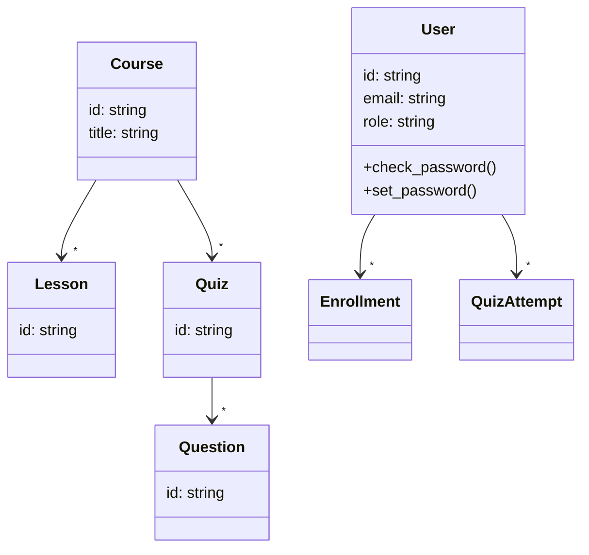

# Class Diagram (Simplified)

```mermaid
classDiagram
  class User {
    id: string
    email: string
    role: string
    +check_password()
    +set_password()
  }
  class Course {
    id: string
    title: string
  }
  class Lesson { id: string }
  class Quiz { id: string }
  class Question { id: string }
  User --> "*" Enrollment
  User --> "*" QuizAttempt
  Course --> "*" Lesson
  Course --> "*" Quiz
  Quiz --> "*" Question
```

Export to docs/diagrams/class-diagram.png
