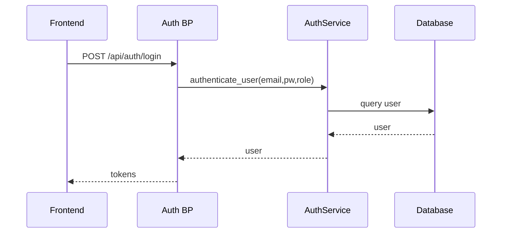

# Sequence: Auth Login

```mermaid
sequenceDiagram
  participant UI as Frontend
  participant API as Auth BP
  participant S as AuthService
  participant DB as Database
  UI->>API: POST /api/auth/login
  API->>S: authenticate_user(email,pw,role)
  S->>DB: query user
  DB-->>S: user
  S-->>API: user
  API-->>UI: tokens
```

Export to docs/diagrams/sequence-auth.png
