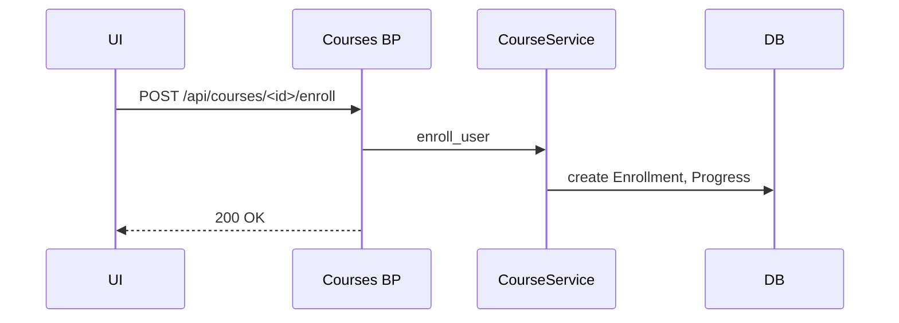

# Sequence: Enroll in Course

```mermaid
sequenceDiagram
  participant UI
  participant C as Courses BP
  participant CS as CourseService
  participant DB
  UI->>C: POST /api/courses/<id>/enroll
  C->>CS: enroll_user
  CS->>DB: create Enrollment, Progress
  C-->>UI: 200 OK
```

Export to docs/diagrams/sequence-enroll.png
