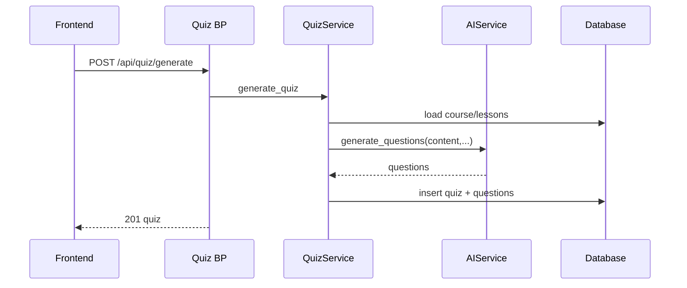

# Sequence: Quiz Generation

```mermaid
sequenceDiagram
  participant UI as Frontend
  participant Q as Quiz BP
  participant QS as QuizService
  participant AI as AIService
  participant DB as Database
  UI->>Q: POST /api/quiz/generate
  Q->>QS: generate_quiz
  QS->>DB: load course/lessons
  QS->>AI: generate_questions(content,...)
  AI-->>QS: questions
  QS->>DB: insert quiz + questions
  Q-->>UI: 201 quiz
```

Export to docs/diagrams/sequence-quiz-gen.png
