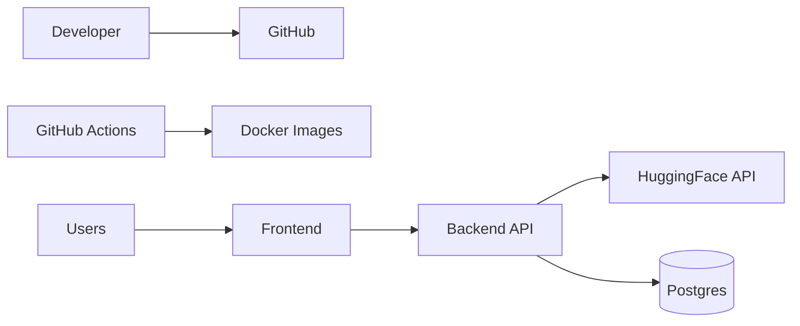

# Technical Context Diagram

```mermaid
graph LR
  Dev[Developer]-->Repo[GitHub]
  CI[GitHub Actions]-->Container[Docker Images]
  Users-->FE[Frontend]
  FE-->API[Backend API]
  API-->HFAI[HuggingFace API]
  API-->DB[(Postgres)]
```

Export to docs/diagrams/technical-context.png
