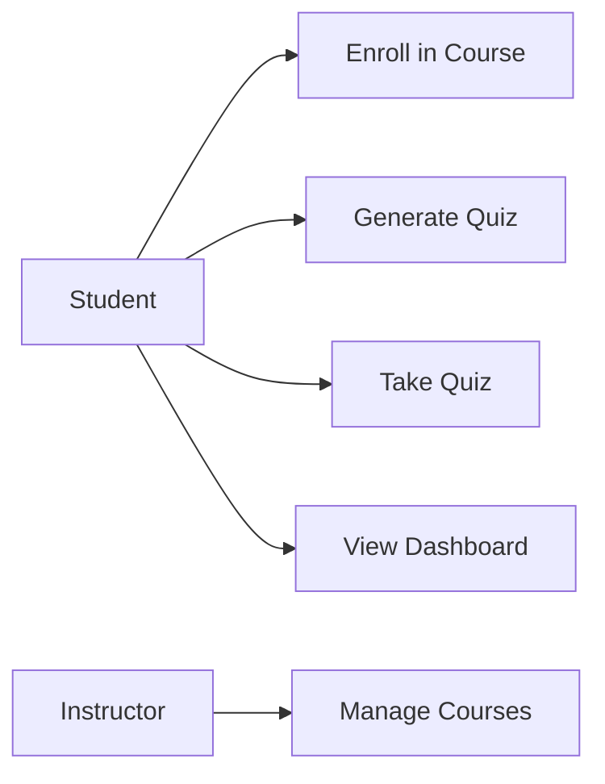

# Use Case Diagram

```mermaid
flowchart LR
    Student-->Enroll[Enroll in Course]
    Student-->GenerateQuiz[Generate Quiz]
    Student-->TakeQuiz[Take Quiz]
    Student-->ViewDash[View Dashboard]
    Instructor-->ManageCourses[Manage Courses]
```

Export instructions: Use VSCode Mermaid or https://mermaid.live to export PNG to docs/diagrams/use-case.png
